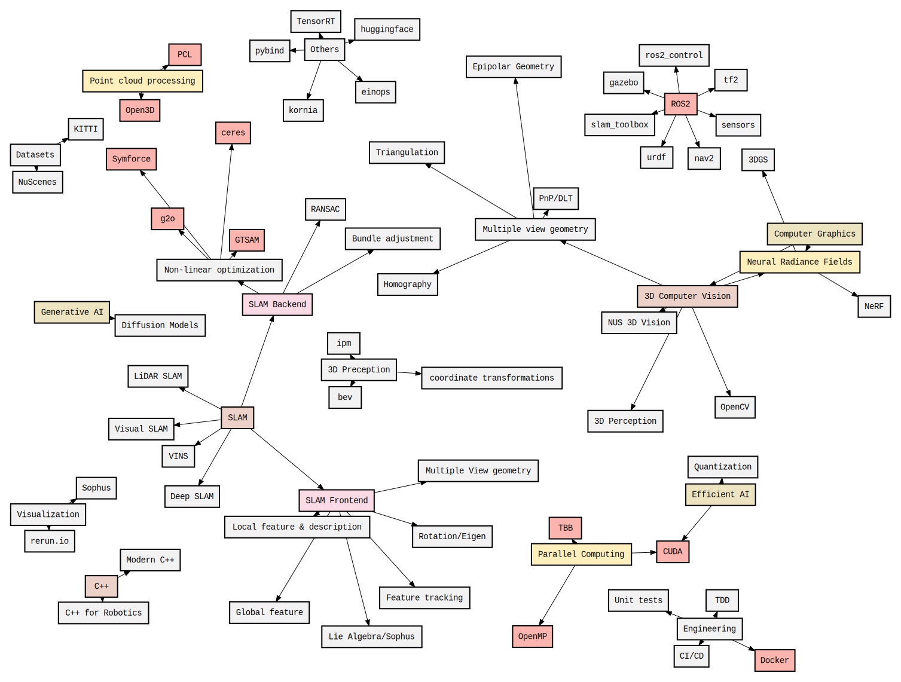

# Spatial_tutorial

### Overview
This repository contains a series of tutorials and examples covering various topics in **spatial AI**, **3D computer vision**, **robotics**, and the underlying mathematical concepts. Each directory focuses on a distinct subject—ranging from C++/JAX programming to CUDA, OpenMP, ROS2, and SLAM.

---

## Table of Contents

| Topic                    | Description                                                                                                                                                                                                                                                                         |
|--------------------------|-------------------------------------------------------------------------------------------------------------------------------------------------------------------------------------------------------------------------------------------------------------------------------------|
| [3DCV](https://github.com/smkim7-kr/3DCV/tree/ba207454e40a1e58e98b89502ea1cfcf16581ae3)            | Lecture notes on [NUS 3D Computer Vision](https://www.youtube.com/playlist?list=PLxg0CGqViygP47ERvqHw_v7FVnUovJeaz), covering traditional 3D computer vision theories and multiple view geometry.                                                                                   |
| [Cpp](https://github.com/smkim7-kr/Cpp/tree/d44ef80baf321af91481f2e22d685867f83c1862)             | C++ and Modern C++ codes (from beginner to advanced). Inspired by [The Cherno C++ playlist](https://www.youtube.com/playlist?list=PLlrATfBNZ98dudnM48yfGUldqGD0S4FFb) and supplemented by [ALIDA’s modern C++ note](https://drive.google.com/viewerng/viewer?url=https://github.com/gyubeomim/gb-supp-mat/blob/main/blog/Notes_on_Modern_C%2B%2B.pdf?raw%3DT). |
| [CUDA](https://github.com/smkim7-kr/cuda_tutorial/tree/a29224df34d60280e32adc97d92a059f79aaa132)            | Basics of CUDA programming (using VS 2022). Code is derived from the Korean book [CUDA 기반 GPU 병렬 처리 프로그래밍](https://product.kyobobook.co.kr/detail/S000202185653), covering parallel GPU computing fundamentals.                                                                 |
| [Docker](https://github.com/smkim7-kr/Docker/tree/35e7e17f6c1d77fb7a9107d6e65aba20b28d3771)        | Basic Docker commands and templates. Some templates are inspired by [@changh95’s GitHub repo](https://github.com/changh95/fastcampus_slam_codes).                                                                                                                                  |
| [Maths](https://github.com/smkim7-kr/Maths/tree/32e272f47fec855411683f777f25927a10197439)          | Notes on linear algebra, multivariate calculus, and matrix calculus for spatial AI. Based on [Angelo’s Math Notes](https://angeloyeo.github.io/2019/09/08/LHopital_rule_en.html).                                                                                                                                  |
| [OpenMP](https://github.com/smkim7-kr/OpenMP/tree/149d2cc8a2a31df0b98e5d10cf8ea8c995d95e6e)        | An introduction to OpenMP for parallel programming. Code is inspired by [@bluekds’s GitHub repo](https://github.com/bluekds/OpenMP-Programming).                                                                                                                                    |
| [ROS2](https://github.com/smkim7-kr/ROS2/tree/85135ab961ea0a34b67a9ea331cedcb6d155ebc1)            | Guides on ROS2 for mobile robotics, covering TF2, URDF, Gazebo, sensors, slam_toolbox, and nav2. Based on [Articulated Robots playlist](https://www.youtube.com/playlist?list=PLunhqkrRNRhYAffV8JDiFOatQXuU-NnxT).                                                                    |
| [SLAM](https://github.com/smkim7-kr/SLAM/tree/d5551b640fcf1037d927fc70e196a55f16a081a4)            | SLAM in Python, covering ICP, PnP, Lie Algebra, transformations, triangulation, point cloud processing, RANSAC, non-linear optimization, etc. C++ examples can be found in [@changh95’s repo](https://github.com/changh95/fastcampus_slam_codes).                                     |
| [VLM101](https://github.com/smkim7-kr/VLM101/tree/16e276884bac152bfa265b3e105e139635c7c164)            | Diverse modules in Large Visual Language Models implementation, covering RoPE, grouped multi query attention, flash attention, tokenization. Some codes are based on [Umar Jami videos](https://github.com/hkproj)                                   |
| [JAX](https://github.com/smkim7-kr/JAX)       |  JAX basic tutorial codes based on [@AakashKumarNain JAX tutorial notebooks](https://github.com/AakashKumarNain/TF_JAX_tutorials) |
| [Reinforcement Learning](https://github.com/smkim7-kr/RL)            | Reinforcement notes based on [Seungsang Oh's RL Lecture](https://www.youtube.com/watch?v=HXIbrL-glpU&list=PLvbUC2Zh5oJtYXow4jawpZJ2xBel6vGhC). Implementation of RL codes using [Gymnasium](https://github.com/Farama-Foundation/Gymnasium) and [SB3](https://github.com/DLR-RM/stable-baselines3) |
| [#TODO Engineering](/)            | Unit code, CI/CD, Profiling |
| [#TODO Diffusion](/)            | Generative AI |
| [#TODO Graphics, 3D rendering](/)            | 3D data, conputer graphics |
| [#TODO Robotics](/)            | Robotics |
| [#TODO EfficientAI](/)            | TinyML, Parallelization, efficiency, memory |
| [#TODO World models](/)            | Multimodal, VLA, MMLM, Pre-training, Post-training |

---

## Code Analysis & Related Projects

Below are code analyses and projects that relate closely to the tutorials above. Each entry highlights the relevant topics and includes a short description.

| Code Analysis / Project                                                            | Related Topics            | Description                                                                                                                                                                                                                             |
|------------------------------------------------------------------------------------|---------------------------|-----------------------------------------------------------------------------------------------------------------------------------------------------------------------------------------------------------------------------------------|
| [mmdetection3d-visualizer](https://github.com/smkim7-kr/mmdet3d-visualizer)        | 3DCV                      | Added a bird’s-eye-view visualization module with a full inference pipeline. Offers detailed code analysis of how 3D detection pipelines work in `mmdetection3d`.                                                                       |
| [gsplat rasterization code analysis](code_analysis/gsplat_rasterization.md)        | 3DCV, CUDA, Cpp           | Analyzes **Gsplat Gaussian rasterization** including projection, encoding, and rendering steps. Explains how data flows through the pipeline and how it’s optimized.                                                                      |
| [Nerfstudio vanilla nerf code analysis](code_analysis/nerfstudio.md)               | 3DCV                      | Explores the **vanilla NeRF** implementation in Nerfstudio. Focuses on the volumetric rendering pipeline and the structure of the code base.                                                                                            |
| [Nerfstudio splatfacto pipeline code analysis](code_analysis/splatfacto.md)        | 3DCV                      | Examines the **Splatfacto** pipeline in Nerfstudio, illustrating how splatting or point-based rendering is integrated and how it differs from vanilla NeRF.                                                                              |
| [VQ-VAE code analysis](https://github.com/smkim7-kr/VLM101/tree/master/vqvae)      | VLM101                    | A **VQ-VAE** (Vector Quantized Variational Autoencoder) PyTorch implementation with annotated code and a breakdown of the architecture and training loop.                                                                                |
| [Flash Attention](https://github.com/smkim7-kr/VLM101/tree/master/FlashAttention)  | VLM101                    | Implementation of **Flash Attention** in Triton, highlighting optimization strategies for attention mechanisms.                                                                                                                           |
| [Simple-PaliGemma](https://github.com/smkim7-kr/VLM101/tree/master/Diffusion_Model)| VLM101                    | Implements a **PaliGemma diffusion model** with in-depth comments on the pipeline and the code structure.                                                                                                                                |
| [#TODO glim](https://github.com/koide3/glim)                                       | SLAM, OpenMP, CUDA, ROS2  | Planned code analysis of **Glim**—a SLAM solution that integrates parallelization via OpenMP and CUDA within a ROS2 framework.                                                                                                            |

---

