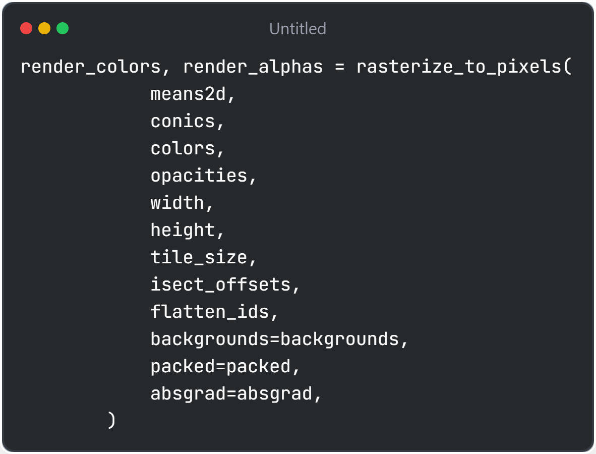

# Following gsplat rasterization code 

##### NOTE: if the link shows wrong code, it may be because main commit is different from when I've written this
##### Use ff2da2e2a5dac795094edf8d5f867ba1d3c6931a instead of main in the link

# Important files
| File | Description |
|-------------------------------------------------|-------------------------|
| `nerfstudio/blob/main/nerfstudio/models/splatfacto.py` | Whole pipeline for 3d gaussian splatting |
| `gsplat/blob/main/gsplat/rendering.py` | gsplat rasterization rendering |
| `gsplat/blob/main/gsplat/cuda/csrc/fully_fused_projection_fwd.cu` | CUDA kenrel for 3d gaussian projection to 2d image space |
| `gsplat/blob/main/gsplat/cuda/csrc/isect_tiles.cu` | CUDA kernel for encoding keys for gaussians and their itersecting tiles |
| `gsplat/blob/main/gsplat/cuda/csrc/rasterize_to_pixels_fwd.cu` | CUDA kernel for tile-based rendering |
| `gsplat/blob/main/gsplat/cuda/_wrapper.py` | Wrapper file that calls CUDA kernel |
| `gsplat/blob/main/gsplat/cuda/csrc/ext.cpp` | Pybind11 that bridge between python api and CUDA kernels  |

| Image | Description |
|-------------------------------------------------|-------------------------|
|  | Rasterization inputs @ https://github.com/nerfstudio-project/gsplat/blob/main/gsplat/rendering.py#L28 1. means, quats, scales, opacities, colors, veiwmats, Ks: gaussians, cameras parameters NOTE: colors.shape = [N, K, 3] where K is SH coefficients or [N, D] if not SH 2. near_plane, far_plane: clipping planes respect to camera frustum 3. radius_clip: Gaussians below radius_clip size will be ignored for efficiency 4. tile_size: tile_size of image for rasterization 5. render_mode: determines whether to output rgb/depth/opacity 6. sparse_grad, packed, channel_chunk: for efficiency and memory management 7. absgrad: from "AbsGS: Recovering Fine Details for 3D Gaussian Splatting" paper 8. rasterize_mode: from "Mip-Splatting: Alias-free 3D Gaussian Splatting" paper|
|  | fully_fused_projection() which projects 3D gaussians to 2D pixel space @ https://github.com/nerfstudio-project/gsplat/blob/main/gsplat/rendering.py#L297   More detail at row below|
|  | fully_fused_projection() @ https://github.com/nerfstudio-project/gsplat/blob/main/gsplat/cuda/_wrapper.py#L203   calls _FullyFusedProjection()    _FullyFusedProjection() @ https://github.com/nerfstudio-project/gsplat/blob/main/gsplat/cuda/_wrapper.py#L775   calls CUDA kernel through _make_lazy_cuda_func()   forward calls "fully_fused_projection_fwd" and backward calls "fully_fused_projection_bwd"| 
|  | Compute spherical harmonics through colors using direction vectors and spherical_harmonics() funcion Clamp colors to prevent negative SH colors| 
|  | When Multi-GPU is used, distribution Gaussians with respective GPUs|
|  | isect_tiles() which identifies intesercting image tiles of gaussians @ https://github.com/nerfstudio-project/gsplat/blob/main/gsplat/rendering.py#L494   Gaussians are mapped to screen-spaced tiles based on their position and radius   More detail at row below|
|  | isect_tiles() @ https://github.com/nerfstudio-project/gsplat/blob/main/gsplat/cuda/_wrapper.py#L342   calls CUDA kernel through _make_lazy_cuda_func()   cuda isect_tiles() are defined @ https://github.com/nerfstudio-project/gsplat/blob/main/gsplat/cuda/csrc/isect_tiles.cu#L15 |
|  | split colors in n_chunks chunks, then perform actual rasterization (since color, 2d gaussians, tile appings are all ready!)|

# fully_fused_projection_fwd 
##### @ https://github.com/nerfstudio-project/gsplat/blob/main/gsplat/cuda/csrc/fully_fused_projection_fwd.cu

| Image | Description |
|-------------------------------------------------|-------------------------|
|  | CUDA kernel fully_fused_projection_fwd_kernel(), where each thread processes one gaussian for one camera Therefore, total C * N threads working in parallel Fetch gaussian center and camera parameters through thread ids (gid, cid)|
|  | Reorder rotation matrices since openGL(glm) library is column-major   pos_world_to_cam() transforms gaussian centre to camera space i.e. $mean_c = R * mean_w + t$  Finally, using near_plane/far_plane discard gaussians out of the range NOTE: OpenGL(glm) library optimized for GPU computations (repsect to parallel computations) e.g. glm::vec3, glm::mat3, glm::mat4|
|  | Compute 3D covariance using rotation(quats) and scales $\Sigma = RSS^TR^T$   quat_scale_to_covar_preci() is defined under include/quat_scale_to_covar_preci.cuh   covar_world_to_cam() transforms 3D covariance to camera space|
|  | quat_scale_to_covar_preci() definition @ https://github.com/nerfstudio-project/gsplat/blob/main/gsplat/cuda/include/quat_scale_to_covar_preci.cuh $\Sigma = RSS^TR^T$|
|  | covar_world_to_cam() definition @ https://github.com/nerfstudio-project/gsplat/blob/main/gsplat/cuda/include/transform.cuh#L39 $\Sigma_{c} = R\Sigma_{w}R^T$|
|  | Projects 3D Gaussians into 2D image (of particular camera view and 3d gaussian)   persp_proj() is defined under proj_fwd.cu|
|  | presp_proj() projects 3D Gaussian into 2D Gaussian @ https://github.com/nerfstudio-project/gsplat/blob/main/gsplat/cuda/include/proj.cuh#L80 1. Extract (x,y,z) 3D Gaussian mean 2. Compute FOV limits based of camera resolution and focal length 3. Normalize depth 4. Check whether projected gaussians are within frustum boundaries, use (tx,ty) to prevent out-of-bound (x,y) values 5. Compute Jacobian matrix that maps 3D covariance to 2D covariance 6. Calculate 2D covariance: $\Sigma_{2d} = J\Sigma_{3d}J^T$ 7. Calculate 2D mean: $u = f_x*(x/z) + c_x, v = f_y*(y/z) + c_y$|
|  | Cull small gaussian below certain radius and outside frustum 1. Compute b: average variance of Gaussian along principal axis 2. Compute v1: largest eigenvaalue, which repersents major axis of the ellipse (this is derived from quadratic form for variance) 3. Compute radius: approximated as 3 std along major axis **NOTE: Projected gaussians should have two principle axis, which are two eigenvalues. However, in rasterization and culling, single radius (i.e. radii[idx]) are used for computational efficiency. Here, 3 std of larger eigenvalue (=major axis of projected gaussian) ensures sufficient approximation since it covers 99.7% of gaussians**|
|  | Cull gaussian by making radius size 0 if small or outside of image pixel space NOTE: This is different from 3D frustum culling in persp_proj() function: frustum culling only checks for gaussian center in 3d space, while here it checks while gaussian in 2d screen space|
|  | Compute inverse of 2d covariance   Output radius/mean/depth/conic(inverse covariance) of particular gaussian at particular camera view image NOTE: 2D covariance is inverted (as conic) because it is used for gaussian evaluation, it only stores upper traingle because 2d cov is symmetric|

# isect_tiles 
##### @ https://github.com/nerfstudio-project/gsplat/blob/main/gsplat/cuda/csrc/isect_tiles.cu

| Image | Description |
|-------------------------------------------------|-------------------------|
|  | Boundary check : 1. if thread index exceeds total number of gaussians, return 2. if gaussian radius isn't positive, return|
|  | Normalize gaussian center in tile coordinates e.g. tile_size=16, center=(32, 0) => tile_x = 32/16 = 2 Scales gaussian radius into tile space (as mentioned before, again here we use single radius per gaussian) e.g. radius 32 => scales to 32/16=2  Calculate tile_min and tile_max, which is top-left and bottom-right corner where gaussian intersects the tiles|
|  | First (of the two) pass - quickly count number of tiles intersected by the gaussian into tiles_per_gauss  purpose: allocate memory|
|  | Prepare for the second pass: assign key for each tiles gaussians up to 64 bits  Lower 32 bits encode **projected depth** (depth_id_enc), used for depth sort in alpha blending   Upper bits encode 10 bits index of **camera_id** (cid_enc) then 22 bits of **tile id** (tile_id)   Such encoding is required for quick GPU Radix Sort cum_tiles_per_gauss, calculated after first pass, has cumulative tile counts of previous gaussians cur_idx contains starting index of intersecting tiles of current idx gaussian Iterate over itersected tile (i,j) isect_ids containes encoded key, and flatten_ids contain gaussian-to-tile mapping indicies|
|  | Radix Sort @ https://github.com/nerfstudio-project/gsplat/blob/main/gsplat/cuda/csrc/isect_tiles.cu#L251 Set keys as isect_ids and values as flatten_ids Sort keys and rearrange corresponding values Sort order are camera_id - tile_id - depth, which are optimized for per-camera, per-tile and per-depth rendering, which are highly parallelizable and improves memory locality Use CUDA Radixsort API NOTE: cub::DeviceRadixSort::SortPairs sort keys in ascending order i.e. close-to-far depth order|

# rasterize_to_pixels
##### @ https://github.com/nerfstudio-project/gsplat/blob/main/gsplat/cuda/csrc/rasterize_to_pixels_fwd.cu

| Image | Description |
|-------------------------------------------------|-------------------------|
|  | Calling rasterization CUDA kernel @ https://github.com/nerfstudio-project/gsplat/blob/main/gsplat/cuda/csrc/rasterize_to_pixels_fwd.cu#L262  Highly parallelizable tile-based rendering code as each CUDA block processes single tile and each CUDA thread processes single pixel within the tile(block) i.e. Total block = # of camera * tile_height * tile_width|
|  | Retrieve ids from grid/block/thread of CUDA kernel gridDim.x are parallel rendered cameras, Each block in x dimension corresponds to specific camera i.e. blockIdx.x = 10 is 11th camera gridDim.y and z corresponds to row and column tiles in the image i.e. tile_id = blockIdx.x * tile_width + blockIdx.z  x and y dimensions within the block (block.thread_index().x/y) repersents column/row of pixel within a tile i.e i = blockIdx.y * tile_size + threadIdx.y **Summary: 3D grid: (camera, tile_rows, tile_colums) & 2D block: (pixel rows, pixel columns), Each grid contributes of single camera(=image) & each block contributes to single tile within the single camera**|
|  | Gaussian relevant to a tile loaded to shared memory, and processed in batches, therefore HBM memory reads reduced|
|  | Each thread within the batch fetch single guassian from low depth to high depth (which was already sorted before)|
|  | For each gaussian in the batch, calculate relevant factors for alpha blending to color pixel 1. conic: inverse of 2d gaussian covariance. Inverse covariance is easier to calculate sigma(density) 2. delta:distance between gaussian center and pixel. Used as inputs of conic equation, which dervies sigma 3. sigma: Evaluate gaussian contribution to a pixel, by calculating distance from gaussian center using conic matrix 4. alpha: Caculate opacity $\alpha = (1-e^{-\sigma})$ 5. T: transmittance calculated by alpha $T = T * (1 - \alpha)$|
|  | Final rendering of color and weights 1. vis: weights for color $\Sigma T*\alpha$ 2. c_ptr: pointer or current color of each pixel 3. pix_out: accumulated final rendered color $C_{pixel} = C_{pixel} + C_{guassian} * (\alpha * T)$ 4. rendered_alphas, rendered_colors: final pixel, rendered_colors are blended with background $\alpha_{pixel} = 1 - T$ and $C_{pixel} = C_{pixel} + T * C_{background}$|