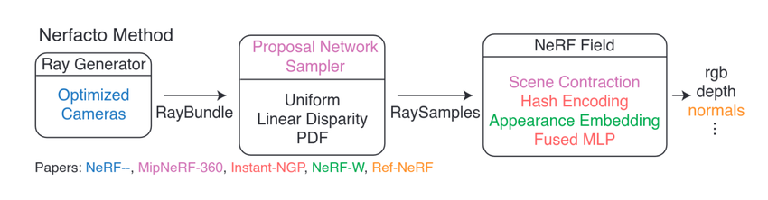
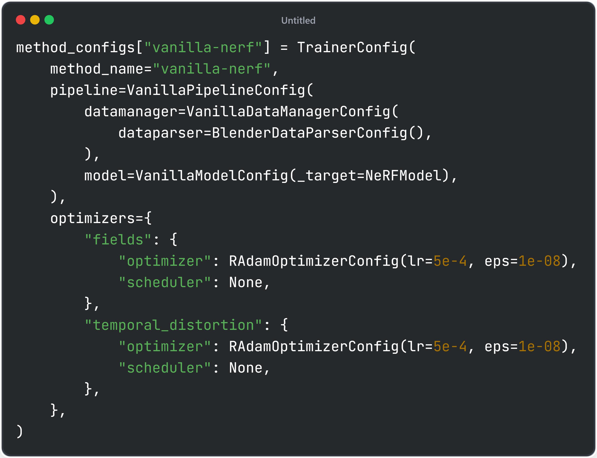
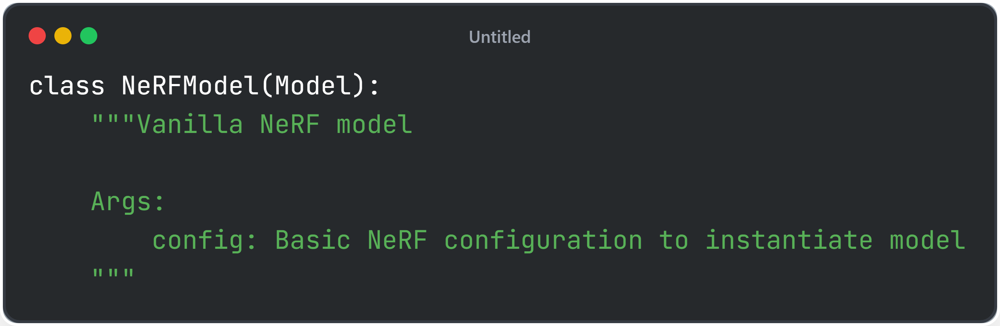
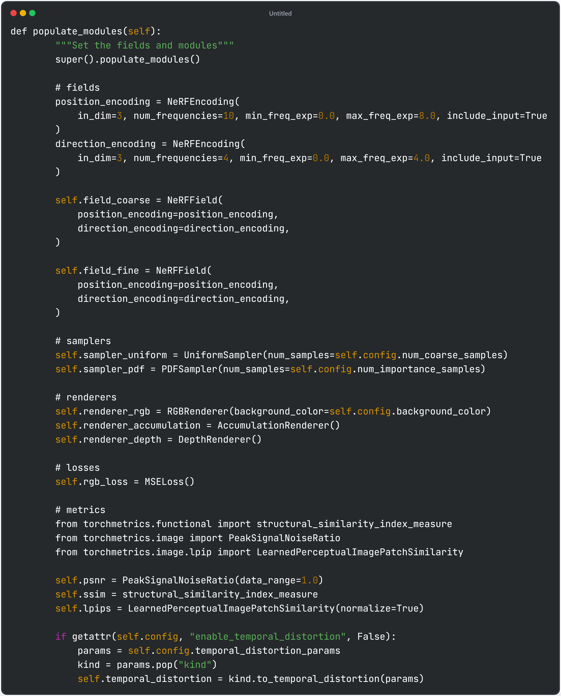
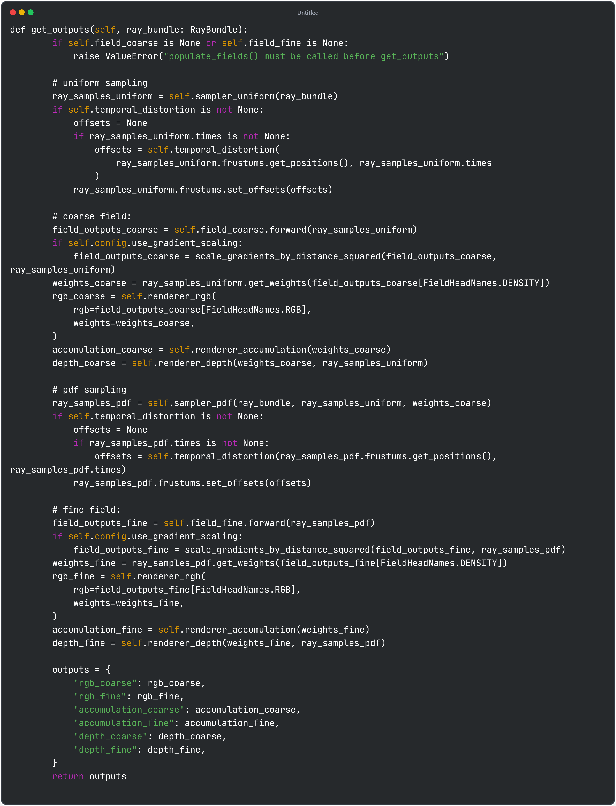
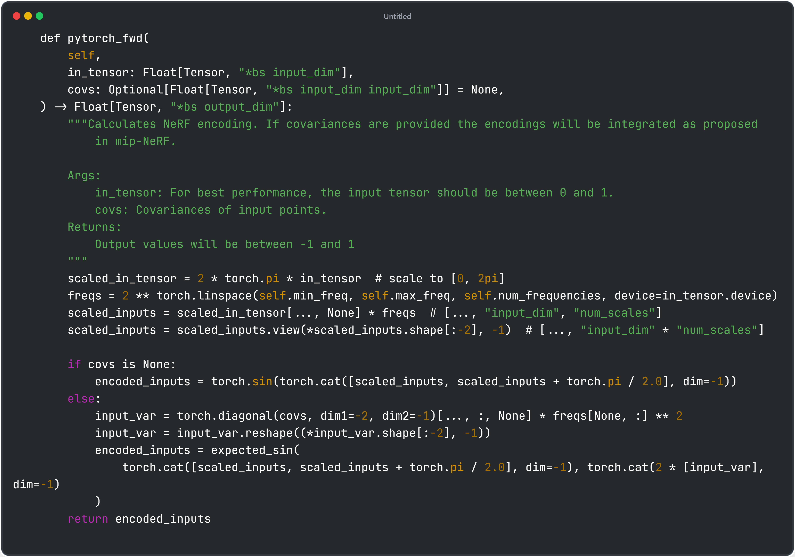
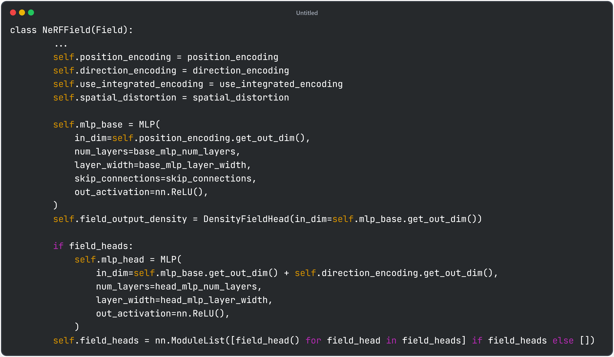
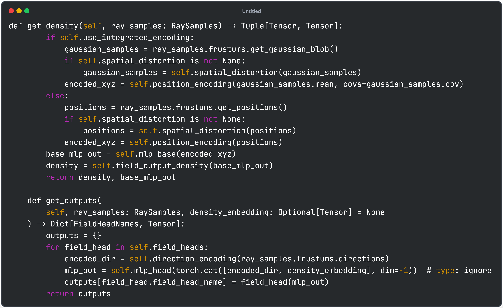
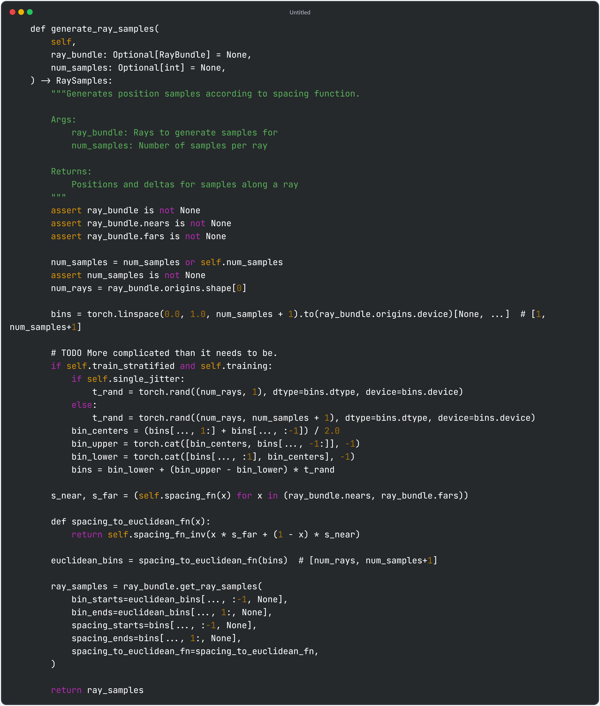
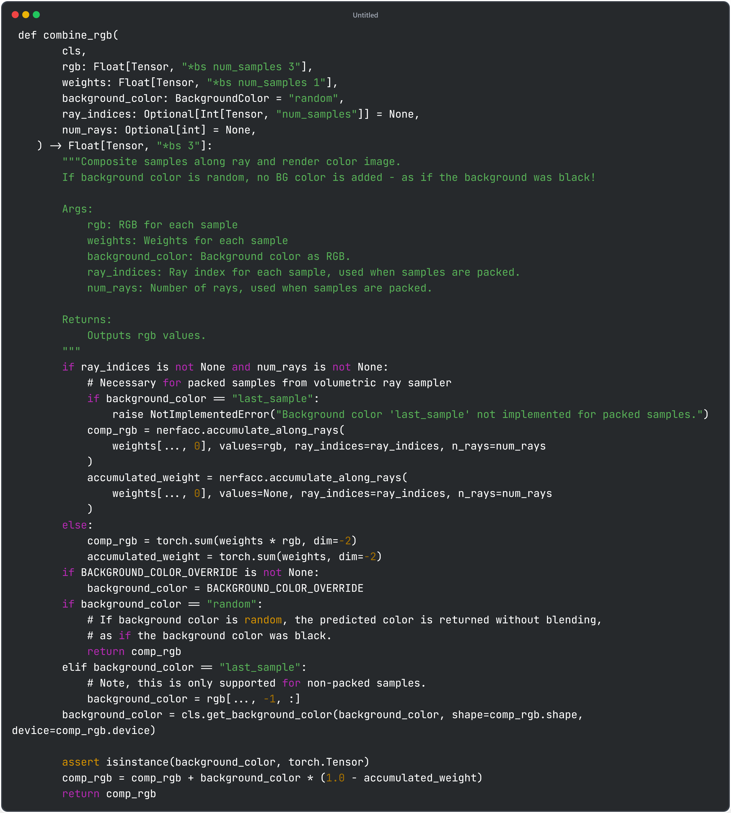

# Following vanilla nerf from nerfstudio

| Image | Description |
|-------------------------------------------------|-------------------------|
|  | Description of the image |
|  | Model Config @ https://github.com/nerfstudio-project/nerfstudio/blob/main/nerfstudio/configs/method_configs.py#L351 |
|  | Model Class @ https://github.com/nerfstudio-project/nerfstudio/blob/main/nerfstudio/models/vanilla_nerf.py#L60 |
|  | populate_models() defines NeRF Model modules @ https://github.com/nerfstudio-project/nerfstudio/blob/main/nerfstudio/models/vanilla_nerf.py#L83   <ui><li> NeRFEncoding: positional encoding of NeRF inputs </li><li> NeRFField: NeRF MLP model - coarse and fine</li><li>Samplers: point sampling along the ray</li><li> Renderers: RGB/Depth volume rendering function</li><li> Losses: MSE loss difference between GT and MLP-output rendered image</li><li> Metrics: PSNR/SSIM/LPIPS metrics</li></ui> | 
|  | get_outputs() outputs RGB pixel colors from ray bundles @ https://github.com/nerfstudio-project/nerfstudio/blob/main/nerfstudio/models/vanilla_nerf.py#L140  Input: Bundle of rays with ray origin and direction defined 1. Uniform sampling of points along the ray  2. Sampled points input -> coarse NeRF MLP -> rendered output & weights  3. Use weights from step 2 for pdf sampling of points along the ray (higher weights = higher probability to be sampled) 4. Sampled points (with higher sampled rate on the object surface) input -> fine NeRF MLP -> final rendered output & weights|
|  | NeRFEncoding.pytorch_fwd() defines position/direction input encoding methods @ https://github.com/nerfstudio-project/nerfstudio/blob/main/nerfstudio/field_components/encodings.py#L153   Increase dimension of inputs using frequencies and sinosidual function i.e. $enc(p) = (sin(2^0 * \pi * p), cos(2^0 * \pi * p) + ... + cos(2^{L-1} * \pi * p))$  Note: only used sin in the implementation since $sin(p + \pi/2) = cos(p)$|
|  | NeRF MLP Network definition @ https://github.com/nerfstudio-project/nerfstudio/blob/main/nerfstudio/fields/vanilla_nerf_field.py#L30  <li>mlp_base & field_output_density: input position and output density</li><li>mlp_head & field_heads: after mlp_base, also input direction and output color</li>|
|  | NeRF MLP Network forward functions @ https://github.com/nerfstudio-project/nerfstudio/blob/main/nerfstudio/fields/vanilla_nerf_field.py#L30  <li>get_density(): positional encoding of position(xyz), then use mlp_base to output density</li><li>get_outputs(): positional encoding of direction, then use mlp_head to output final rgb color</li>|
|  | SpacedSampler.generate_ray_samples() generate sample points along the ray @ https://github.com/nerfstudio-project/nerfstudio/blob/main/nerfstudio/model_components/ray_samplers.py#L78  <li>bins define uniform points from 0 to 1</li><li>spacing_fn determines the nearest and farthest points in 3D space</li><li>i.e. bin[0] maps to s_near, bin[-1] maps to s_far, thus bounded</li><li>ray_samples are collected using get_ray_samples</li>|
|  | PDFSampler.generate_ray_samples() generate sample points along the ray for fine network @ https://github.com/nerfstudio-project/nerfstudio/blob/main/nerfstudio/model_components/ray_samplers.py#L276  <li>Use weights to define cumulative density function(cdf)</li><li>Inverse transform samping: generate uniform samples u from 0 to 1, then use cdf to map uniform samples to target distributions along the ray</li>|
|  | RGBRenderer.combine_rgb() takes volumetric rendering along the ray's sampled points @ https://github.com/nerfstudio-project/nerfstudio/blob/main/nerfstudio/model_components/renderers.py#L201  <li> Use [nerfacc](https://github.com/nerfstudio-project/nerfacc) library to accelerate rendering process</li><li>blend background color with computed rendered rgb color</li>|
