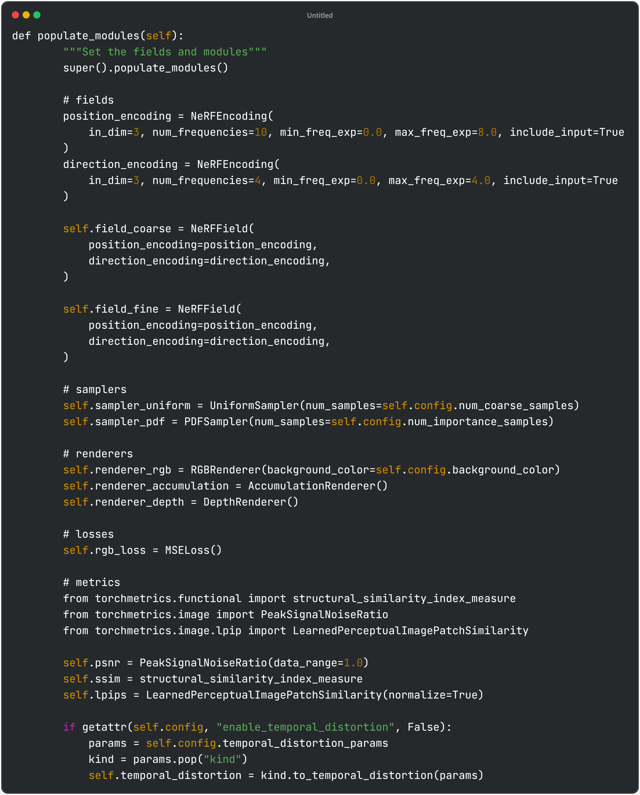
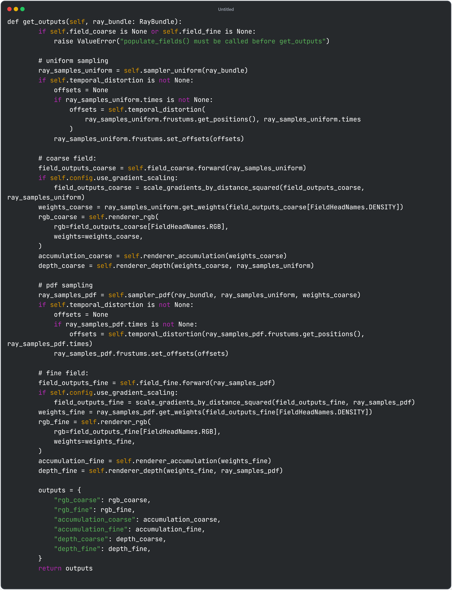

# Following splatfacto from nerfstudio

##### NOTE: splatfacto depends on gsplat library

| Image | Description |
|-------------------------------------------------|-------------------------|
|  | Model Config @ https://github.com/nerfstudio-project/nerfstudio/blob/main/nerfstudio/configs/method_configs.py#L592 Optimizer are defined for each property of 3d guassians Note: Camera parameters are also optimized in this implementation (at "camera_opt") |
|  | Model Class @ https://github.com/nerfstudio-project/nerfstudio/blob/main/nerfstudio/models/splatfacto.py#L161 |
|  | populate_models() sets up modules for gaussian-based rendering and optimization @ https://github.com/nerfstudio-project/nerfstudio/blob/main/nerfstudio/models/splatfacto.py#L179   <ui><li> means: center position of Gaussian points (based on seed_points) </li><li> scales: initialize by average distances of 3 nearest neighbor points (Use log distances for stability and positive scales)</li><li>quats: random orientations for each gaussians</li><li> shs: Use spherical harmoics to define coloar and appearance - feature_dc is base color/features_rest is high-order SH coefficients</li><li> opacities: initialize to 0.1, use logits for numerical stability</li><li> CameraOptimizer: camera parameters for rendering and optimization</li><li>Metrics: PSNR/SSIM/LPIPS</li><li>background_color</li><li>DefaultStrategy: strategy to pruning/cloning gaussians (other options: MCMCStrategy)</li><li>NOTE: all the utility functions e.g. SH encoding, KNN, random quat initialization are under nerfstudio/utils</ui> | 
|  | get_outputs() render outputs (rgb, depth, opacity) @ https://github.com/nerfstudio-project/nerfstudio/blob/main/nerfstudio/models/splatfacto.py#L446  Input: Cameras' intrinsics and extrinsics 1.Optimize camera pose during training, inference takes camera_to_worlds directly  2. For efficiency, could crop regions of interests, thus control number of gaussians  3. adjust camera resolution and matrices for rendering 4. adjust spherical harmonics (sh_degree_to_use) based on current training step  5. rasterize rgb/depth(optional)/opacity|

